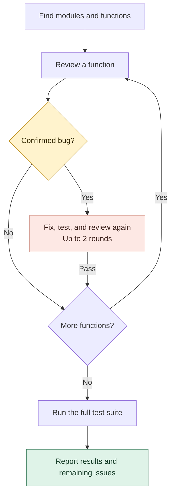

# Team Leader — Coordinate AI Coding Agents

Team Leader splits work among AI coding agents, tracks their progress, and brings
their results together. Use it as a skill in Codex or Claude Code, or run its
Python controller directly.

It is useful when a project has tasks that can run separately: implementing
several modules, reviewing changes, or investigating possible fixes. Each CLI
worker has its own session and tools. For a small edit, one agent is usually enough.

[Installation](#installation) · [Quick start](#quick-start) · [Workflow demo](#one-request-five-workflow-building-blocks) · [Supported providers](#supported-providers) · [API workers](#api-workers) · [FAQ](docs/faq.md)

## What it handles

- Runs independent tasks in parallel and waits for prerequisites when needed.
- Gives workers separate Git working directories, then combines their changes for testing.
- Saves progress, reports, and logs so you can monitor work and resume sessions.
- Lets you choose different coding tools or API models for different tasks.

## Supported providers

| Coding tool | Provider ID | Executable |
| --- | --- | --- |
| Codex CLI | `codex` | `codex` |
| Claude Code | `claude` | `claude` |
| Cursor Agent | `cursor` | `cursor-agent` |
| Kiro CLI | `kiro` | `kiro-cli` |

Install and sign in to each tool you want to use. Codex is the controller's
default; the Claude Code skill selects Claude for planning and workers. You can
choose another provider explicitly.

## Installation

You need **Python 3.10+** and **Git** for separate worker checkouts. The controller
uses only Python's standard library. CLI workers need one of the tools above;
API workers need a compatible endpoint and its credentials.

### Install into Codex or Claude Code

Ask either tool:

```text
Install the team-leader and team-status skills from 2Mars4096/team_leader
for the coding tool I am using.
```

The skills go in `~/.codex/skills/` for Codex or `~/.claude/skills/` for Claude Code. Restart Codex after installation.

<details>
<summary>Manual installation</summary>

For Claude Code:

```bash
git clone https://github.com/2Mars4096/team_leader.git
mkdir -p ~/.claude/skills
cp -R team_leader/skills/team-leader ~/.claude/skills/
cp -R team_leader/skills/team-status ~/.claude/skills/
```

For a manual Codex installation, use `~/.codex/skills/` instead.
Claude Code also supports project-local installation in `.claude/skills/`.
See [Claude's skill documentation](https://code.claude.com/docs/en/skills).

</details>

## Quick start

Open the project you want to work on and give the manager a goal and a test command.

**In Codex:**

```text
Use $team-leader to refactor checkout in this repository.
Name the project checkout-refactor. Validate with pytest -q.
```

**In Claude Code:**

```text
/team-leader Refactor checkout in this repository. Name the project checkout-refactor. Use Claude workers and validate with pytest -q.
```

The manager plans tasks, starts workers, reviews their results, and runs validation.
To check progress, ask Codex to use `$team-status` or Claude Code to use
`/team-status` for `checkout-refactor`.

### Using the controller script directly

Run commands from the **project you want to work on**. Set `TL` to the controller
in your checkout or installed skill. This example uses Claude for planning and workers:

```bash
TL=/path/to/team_leader/skills/team-leader/scripts/team_leader.py

python3 "$TL" provider-check --provider claude

python3 "$TL" intake \
  --project checkout-refactor \
  --goal "Refactor checkout to reduce payment failures" \
  --repo-path . \
  --planner-provider claude \
  --child-provider claude \
  --allow-provider claude \
  --validation-command "pytest -q"

python3 "$TL" orchestrate --project checkout-refactor
python3 "$TL" team-status --project checkout-refactor --once
```

Progress is saved under `.team-leader/` in that project. Reusing a project name
continues its history; use a new name for a fresh start.

## One request, five workflow building blocks

Review every function, fix confirmed bugs, then test the whole project.



**Paste this into Codex** with the team-leader skill installed. Replace the path
with a dedicated checkout of your project. The indented text is your request;
you do not need to write a workflow configuration.

```text
Use $team-leader to create and run a workflow named module-review
in /path/to/dedicated-checkout. Preserve the loops and branches below.

Workers:
  reviewer — read-only, up to 2 at once
  editor — can edit and run tests, 1 at a time
  Maximum 3 outstanding tasks overall.

FIRST discover the project's modules, public functions, and test commands.
  Exclude generated files and third-party code.

FOR EACH module (independent reviews may run in parallel):
  FOR EACH public function (one at a time within this module):
    REVIEW the function and save the verdict with concrete evidence.

    IF a bug is confirmed:
      REPEAT UNTIL the review passes, at most 2 rounds:
        EDITOR: make a minimal fix and run the relevant tests.
        REVIEWER: check the revised code and test results.
    ELSE:
      Record the passing review and leave the code unchanged.

  Collect this module's results.

FINALLY have the editor run the full test suite.
  IF it passes:
    Summarize changes, checks, and remaining limitations.
  ELSE:
    Report failures and return an uncertain acceptance result.

If required evidence is missing, return uncertain and block the workflow.
If two repair rounds do not pass, block and report why.
```

This uses all five building blocks: **actions**, **ordered steps**, **nested
loops**, **if/else**, and **repeat until**. Edits run separately from reviews;
missing evidence or exhausted repair limits block further work.

The workflow engine requires **Codex**. See the
[workflow guide](skills/team-leader/references/workflows.md) for configuration,
pausing, and resuming.

## API workers

Use `api run` for models served through **OpenAI-compatible Chat Completions** or
**Anthropic Messages**. A plan specifies each worker's endpoint, model, and
credential variable, and can mix providers. This includes compatible third-party
gateways and local servers.

API workers receive supplied text and return proposals. The manager handles file
edits and tests. They do not have CLI tools or resumable sessions.

Follow the [API worker guide](skills/team-leader/references/api-workers.md) to
create a plan, configure credentials, and preview or execute a batch. Execution
requires `--execute` and a cost-estimate limit; the limit checks estimates rather
than capping the provider's bill.

For OpenRouter model selection based on saved cost and quality data, or PDF
inputs, use the separate [OpenRouter guide](skills/team-leader/references/openrouter-workers.md).

## Operating limits

CLI runs default to at most **8 concurrent workers** and **2 new starts per
15 seconds**. Use `--max-work-seconds` to set a project work window and
`--max-run-seconds` to limit an individual worker. Workers consume usage from
their selected provider.

Separate checkouts reduce conflicts, but combining changes can still require
review. Check the manager's reports and validation results before accepting the work.
If the manager asks questions, put answers in the project's `answers.md` file.
The [workspace guide](skills/team-leader/references/project-workspaces.md)
explains the saved files and how much work the manager can do automatically.

## CLI reference

Run `python3 "$TL" --help` for commands, or add `--help` after a command for its
options. Common commands are:

| Command | Purpose |
| --- | --- |
| `intake` / `orchestrate` | Record a goal, then plan and start workers |
| `dispatch` / `batch` | Start one worker or a batch of assigned tasks |
| `status` / `team-status` | Check progress |
| `show` / `tail` | Inspect a worker's result or logs |
| `resume-cmd` | Print the command to resume a session |
| `cancel` | Stop a worker |
| `provider-check` | Check that a coding tool is ready |

## Further reading

- [FAQ](docs/faq.md): compatibility, installation, and common questions.
- [Codex workflows](skills/team-leader/references/workflows.md): turn instructions with loops and conditions into repeatable work. This feature requires Codex, including when Claude is the manager.
- [Task prompt examples](skills/team-leader/references/prompt-patterns.md) and [batch manifest](skills/team-leader/references/example_manifest.json): assign work directly.
- [Provider adapters](skills/team-leader/references/provider-adapters.md): how to add another coding tool.
- [Controller source](skills/team-leader/scripts/team_leader.py) and [tests](tests/): implementation and checks.
