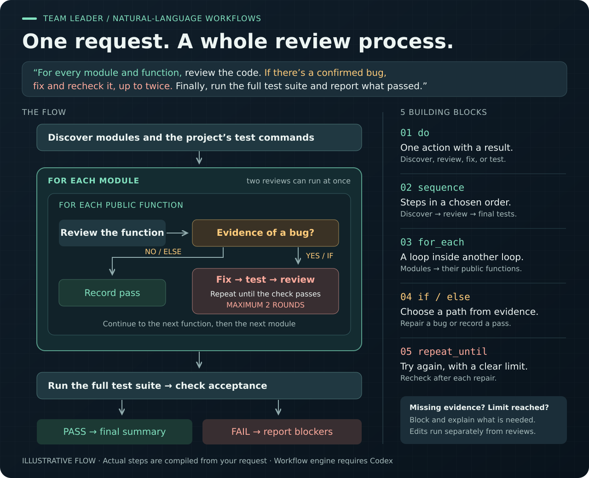

# Team Leader — Coordinate AI Coding Agents

Team Leader splits work among AI coding agents, tracks their progress, and brings
their results together. Use it as a skill in Codex or Claude Code, or run its
Python controller directly.

It is useful when a project has tasks that can run separately: implementing
several modules, reviewing changes, or investigating possible fixes. Each CLI
worker has its own session and tools. For a small edit, one agent is usually enough.

[Installation](#installation) · [Quick start](#quick-start) · [Workflow demo](#one-request-five-workflow-building-blocks) · [Supported providers](#supported-providers) · [API workers](#api-workers) · [FAQ](docs/faq.md)

## What it handles

- Runs independent tasks in parallel and waits for prerequisites when needed.
- Gives workers separate Git working directories, then combines their changes for testing.
- Saves progress, reports, and logs so you can monitor work and resume sessions.
- Lets you choose different coding tools or API models for different tasks.

## Supported providers

| Coding tool | Provider ID | Executable |
| --- | --- | --- |
| Codex CLI | `codex` | `codex` |
| Claude Code | `claude` | `claude` |
| Cursor Agent | `cursor` | `cursor-agent` |
| Kiro CLI | `kiro` | `kiro-cli` |

Install and sign in to each tool you want to use. Codex is the controller's
default; the Claude Code skill selects Claude for planning and workers. You can
choose another provider explicitly.

## Installation

You need **Python 3.10+** and **Git** for separate worker checkouts. The controller
uses only Python's standard library. CLI workers need one of the tools above;
API workers need a compatible endpoint and its credentials.

### Install into Codex

Ask Codex:

```text
Install the team-leader and team-status skills from 2Mars4096/team_leader.
```

The skills go in `~/.codex/skills/`. Restart Codex after installation.

### Install into Claude Code

```bash
git clone https://github.com/2Mars4096/team_leader.git
mkdir -p ~/.claude/skills
cp -R team_leader/skills/team-leader ~/.claude/skills/
cp -R team_leader/skills/team-status ~/.claude/skills/
```

For a manual Codex installation, use `~/.codex/skills/` instead.
Claude Code also supports project-local installation in `.claude/skills/`.
See [Claude's skill documentation](https://code.claude.com/docs/en/skills).

## Quick start

Open the project you want to work on and give the manager a goal and a test command.

**In Codex:**

```text
Use $team-leader to refactor checkout in this repository.
Name the project checkout-refactor. Validate with pytest -q.
```

**In Claude Code:**

```text
/team-leader Refactor checkout in this repository. Name the project checkout-refactor. Use Claude workers and validate with pytest -q.
```

The manager plans tasks, starts workers, reviews their results, and runs validation.
To check progress, ask Codex to use `$team-status` or Claude Code to use
`/team-status` for `checkout-refactor`.

### Using the controller script directly

Run commands from the **project you want to work on**. Set `TL` to the controller
in your checkout or installed skill. This example uses Claude for planning and workers:

```bash
TL=/path/to/team_leader/skills/team-leader/scripts/team_leader.py

python3 "$TL" provider-check --provider claude

python3 "$TL" intake \
  --project checkout-refactor \
  --goal "Refactor checkout to reduce payment failures" \
  --repo-path . \
  --planner-provider claude \
  --child-provider claude \
  --allow-provider claude \
  --validation-command "pytest -q"

python3 "$TL" orchestrate --project checkout-refactor
python3 "$TL" team-status --project checkout-refactor --once
```

Progress is saved under `.team-leader/` in that project. Reusing a project name
continues its history; use a new name for a fresh start.

## One request, five workflow building blocks

“Review every module and function. If you find a confirmed bug, fix and recheck
it, up to twice. Then run the full test suite.”

That request combines all **five supported building blocks**: an action (`do`),
ordered steps (`sequence`), loops (`for_each`), decisions (`if` with `else`), and
bounded retries (`repeat_until`). Loops can nest, and independent reviews can
run together.



<details>
<summary><strong>Copy the complete natural-language request</strong></summary>

Paste this into Codex with the team-leader skill installed. Replace the checkout
path with a dedicated checkout of your project. This starts real Codex work.

```text
Use $team-leader's workflow engine to create a workflow named module-review
in /path/to/dedicated-checkout.

Create two worker types:
- reviewer: read-only, at most two active reviews.
- editor: allowed to edit and run tests, at most one active task.
Limit the workflow to three outstanding tasks overall.

First, discover the project's own modules, their public functions, and the
available test commands. Exclude generated files and third-party code.

For each module, review its public functions one at a time. Different modules
may be reviewed in parallel. Reuse a reviewer conversation within each module.

For each function:
1. Have the reviewer check for bugs and save the verdict with concrete evidence.
2. If a bug is confirmed, repeat these steps until the reviewer passes it,
   with a maximum of two repair rounds:
   - Have the editor make a minimal fix and run the relevant tests.
   - Have the reviewer check the revised code and test evidence again.
3. Otherwise, leave the code unchanged and record the passing review.
Collect each function's result and then each module's results.

After all modules finish, have the editor run the full test suite.
If it passes, have the reviewer summarize the changes, checks, and remaining
limitations. Otherwise, report the failures and mark acceptance as unresolved.

Represent the loops, branches, and repeat limit explicitly in the workflow.
Missing required files or ambiguous test results must return uncertain and
block the workflow. If two repair rounds do not pass, block and report why.
A failed final test suite must also produce an uncertain acceptance result.
```

The manager creates the worker settings and submits the request to the workflow
planner. Inspect the compiled steps and saved results under
`.team-leader/workflows/module-review/`. The diagram illustrates the intended
flow; it is not a recorded run or a guarantee of the planner's exact output.

</details>

The workflow engine currently requires **Codex**. Edits run separately from
reviews; uncertain results or exhausted repair limits block further work.
See the [workflow guide](skills/team-leader/references/workflows.md) for settings,
pausing, and resuming.

## API workers

Use `api run` for models served through **OpenAI-compatible Chat Completions** or
**Anthropic Messages**. A plan specifies each worker's endpoint, model, and
credential variable, and can mix providers. This includes compatible third-party
gateways and local servers.

API workers receive supplied text and return proposals. The manager handles file
edits and tests. They do not have CLI tools or resumable sessions.

Follow the [API worker guide](skills/team-leader/references/api-workers.md) to
create a plan, configure credentials, and preview or execute a batch. Execution
requires `--execute` and a cost-estimate limit; the limit checks estimates rather
than capping the provider's bill.

For OpenRouter model selection based on saved cost and quality data, or PDF
inputs, use the separate [OpenRouter guide](skills/team-leader/references/openrouter-workers.md).

## Operating limits

CLI runs default to at most **8 concurrent workers** and **2 new starts per
15 seconds**. Use `--max-work-seconds` to set a project work window and
`--max-run-seconds` to limit an individual worker. Workers consume usage from
their selected provider.

Separate checkouts reduce conflicts, but combining changes can still require
review. Check the manager's reports and validation results before accepting the work.
If the manager asks questions, put answers in the project's `answers.md` file.
The [workspace guide](skills/team-leader/references/project-workspaces.md)
explains the saved files and how much work the manager can do automatically.

## CLI reference

Run `python3 "$TL" --help` for commands, or add `--help` after a command for its
options. Common commands are:

| Command | Purpose |
| --- | --- |
| `intake` / `orchestrate` | Record a goal, then plan and start workers |
| `dispatch` / `batch` | Start one worker or a batch of assigned tasks |
| `status` / `team-status` | Check progress |
| `show` / `tail` | Inspect a worker's result or logs |
| `resume-cmd` | Print the command to resume a session |
| `cancel` | Stop a worker |
| `provider-check` | Check that a coding tool is ready |

## Further reading

- [FAQ](docs/faq.md): compatibility, installation, and common questions.
- [Codex workflows](skills/team-leader/references/workflows.md): turn instructions with loops and conditions into repeatable work. This feature requires Codex, including when Claude is the manager.
- [Task prompt examples](skills/team-leader/references/prompt-patterns.md) and [batch manifest](skills/team-leader/references/example_manifest.json): assign work directly.
- [Provider adapters](skills/team-leader/references/provider-adapters.md): how to add another coding tool.
- [Controller source](skills/team-leader/scripts/team_leader.py) and [tests](tests/): implementation and checks.
